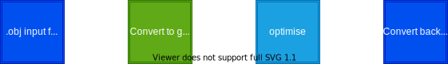
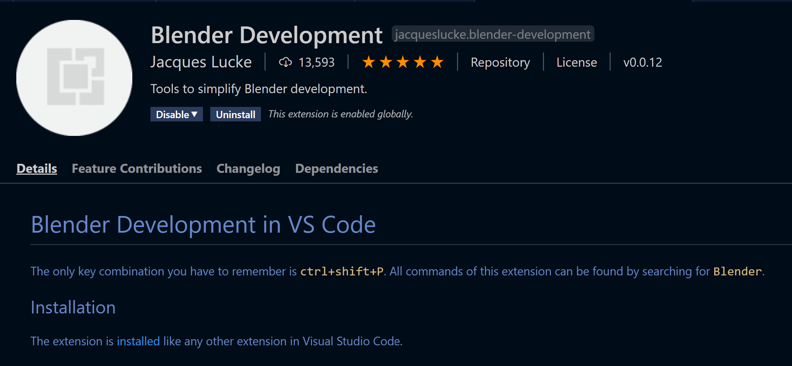
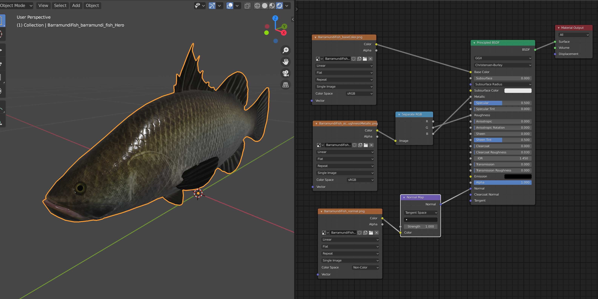
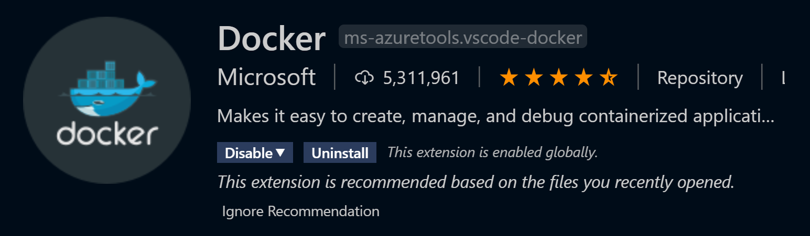
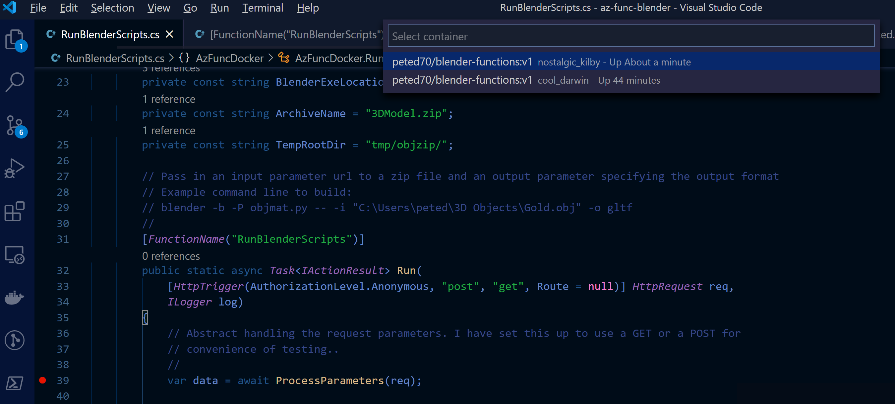
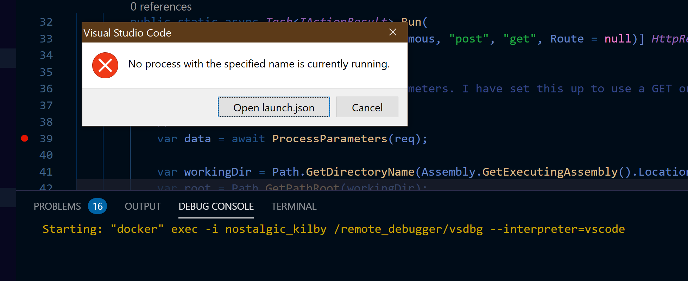
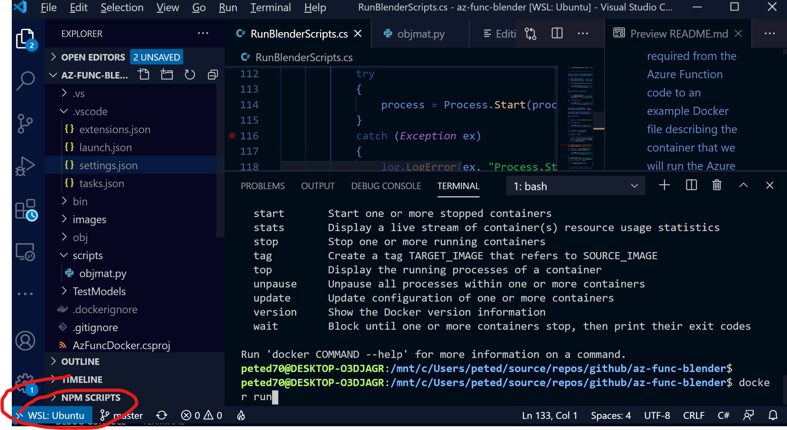
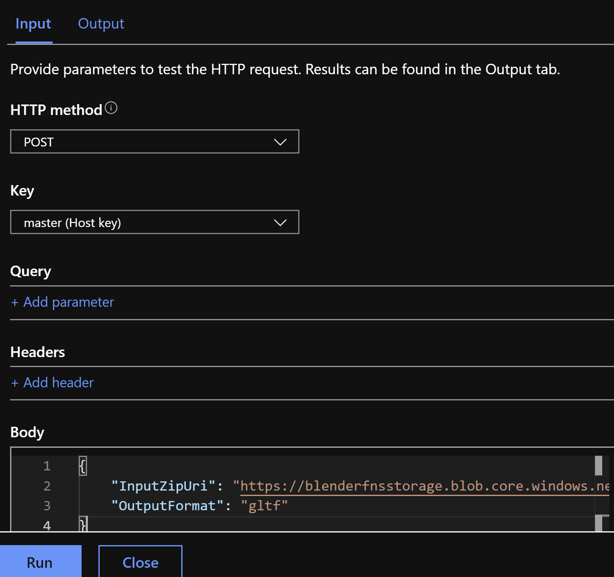
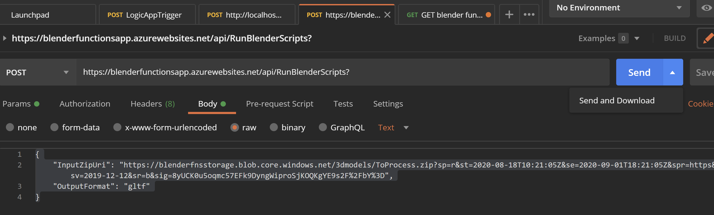

# Azure :heart: Blender

In this post I will explore running Blender in an Azure function in order to automate elements of a 3D model pipeline in a scalable and cost-effective way. I will provide a code repo of all of the elements required from the Azure Function code to an example Docker file describing the container that we will run the Azure function in to some example Python scripts which allow automation of Blender functionality.

## Content Pipeline

Just to set the scene I'll give a simple illustrative example of what I mean by a content pipeline and give some examples of what it might be used for. So, imagine that I am starting with some high-resolution 3D models that have been created with some scanning hardware and the model has too much geometry to run efficiently on a mobile device such as HoloLens or a mobile phone. I also have some software that will optimise the model for the target devices but it only takes the glTF file format as input. So if I can create a pipeline node that will convert my input file to and from glTF then I can string nodes together as below to create my content pipeline.



Blender can very easily be used to automate 3D file format conversions but can also be used to automate more complex scenarios such as:

- Generating synthetic data for input to train Machine Learning models to do object recognition

- Generating normal maps by baking lighting information from a high density 3D model onto a normal map to be used with a model that has reduced geometry so we can preserve a lot of the lighting detail.

- Generating a rendered movie of a camera orbiting around a 3D model so that the result can be checked as part of a model quality checking process

These are a few useful examples that spring to mind as I have real-world experience with these but of course, the combinations are endless and given a set of processing nodes can be configured to fit the scenario.

The rest of this post will be concerned with all aspects of setting up a pipeline like this. The moving parts we will need to understand for this are:

- How do we automate Blender to carry out the processing for nodes we might need?

- How can we host the processing in the cloud? We are going to be using the Azure cloud for this.

## Blender

Blender has been hitting the news a bit recently with some notable additions to the [Blender Development Fund](https://fund.blender.org/)


> Blender has been around for 25 years or so as a free and open source 3D content creation and rendering tool. It has become a cornerstone in the 3D pipeline and it's freeness sets it apart from some of it's competitors. The industry investment is a signal that Blender is a key piece of technology for the future landscape and another indicator that the tipping point for adoption of spatial computing is in the not-too-distant future.  

Blender can be used for 3D modeling, sculpting, creating and applying materials, rendering, character rigging, particle simulation, animation, 2D animation, editing and compositing.

> For Windows 10 users; Blender also appears in the Windows 10 Store so you can make use of auto-updates

### Blender Automation

So, as well as all of the rich functionality for 3D content creation we can also automate it using the Python scripting interface. Blender has an embedded Python interpretor and a Python library exposing most of the functionality. The first step would be to open the Scripting tab which can be found along the top of the application to the far right.

<replace with gif>


This configures Blender into a scripting friendly workspace where you have the following windows:

- 3D viewport

> The usual 3D viewport but allows you to visualise script commands as you run them

- Python console

> You can run commands here and also explore the bpy library. type **bpy.** and then press **TAB** for an autocomplete list

- Info window

> As you carry out user operations in Blender the associated script will get output here. You can copy the output from here directly into your script. (Note. this won't always give you what you want as some of the operations are highly context sensitive but it provides a good starting point)

- Text Editor (where we write the Python code)

> Enter the text for the script here, always starting with **import bpy**. Under the templates menu you can find examples of python scripting from creating add-ons to UI-driven scripts. (We're only interested in **Background Job** for now).


I'm no going to attempt a tutorial of this as there are many online already but I have included some useful tips.

#### Visual Studio Code Extension

One last tip is to point you at the VS Code Extension for Blender Development.



## Example Content Pipeline Script

I'll now present the example script I'm going to use for this post.

The script is an example of how you can run blender from the command line (in background mode with no interface) to automate tasks. This example will

> - load a .obj file
> - load albedo, normal and ambient occlusion/roughness/metallic maps
> - create a Principled BSDF material using those textures as input
> - output the file as either an obj + obj material (without the PBR textures since those are unsupported in obj format) or a glTF file with the PBR textures assigned.

For now, to run this you would need to have blender installed and it's executable location in your PATH. Then you can run it like this where all args after the -- are passed to the script. File output options are currently gltf and obj.

```bat
blender -b -P ./scripts/objmat.py -- -i ./TestModels/barramundi.obj -o gltf
```

The result should be a copy of the file in a folder named *converted* with *_converted* appended to the filename and with an additional .mtl file in the same folder as the original file. Alternatively, there will be a glTF file there which references the loose textures. The script recursively searches folders from the original file location looking for textures by name, i.e. albedo, normal and orm. There is a distinct lack of error handling as I just wanted to use this as a handy example.

Notes. Some 3D software supports an ORM map in an obj material by adding the line

> map_ORM ORM.png

to the .mtl file. This is non-standard and un-supported by some 3D tools. For this kind of PBR support glTF can be used.

To be honest it doesn't really matter what the script does as long as we can show a script which takes some input and process it to provide some measurable output, and I have this script written and tested already.  

Here's the script being run from the command line and also showing the output:


> The sample input is provided in the Github repo

Here's the main part of the script:

``` python
def load_obj_and_create_material(input_file, outputFormat):

    # Clear existing objects.
    bpy.ops.wm.read_factory_settings(use_empty=True)
    
    # Clear the current scene - useful if we want to run inside blender and retain preferences
    # for item in bpy.context.scene.objects:
    #    bpy.data.objects.remove(item, do_unlink=True)
    bpy.ops.import_scene.obj(filepath=input_file)
    
    #obj_object = bpy.context.selected_objects[0] ####<--Fix
    # make sure to get all imported objects
    obs = [ o for o in bpy.context.scene.objects if o.select_get() ]

    print('Imported objects: count = ' + str(len(obs)))
    for ob in obs:
        print(ob.name)

    numImportedPolygons = 0
    for ob in obs:
        numImportedPolygons += len(ob.data.polygons)
        
    print('Number of imported polygons = ' + str(numImportedPolygons))

    newmat = bpy.data.materials.new('newmat')
    newmat.use_nodes = True
    node_tree = newmat.node_tree

    # asign the new material to each imported mesh
    for ob in obs:
        # Assign it to object
        if ob.data.materials:
            # assign to 1st material slot
            ob.data.materials[0] = newmat
        else:
            # no slots
            ob.data.materials.append(newmat)

    nodes = node_tree.nodes
    pbdf = nodes.get("Principled BSDF")
    
    albedoFile = ''
    normalFile = ''
    ORMFile = ''

    # we want to locate and load image by name so albedo, normal and ORM
    for dirpath, _, files in os.walk(os.path.dirname(input_file)):
        for filename in files:
            filenameLower = filename.lower()
            if filenameLower.endswith('.png'):
                print(filename)
                if IsAlbedo(filenameLower):
                    albedoFile = os.path.abspath(os.path.join(dirpath, filename))
                elif IsNormal(filenameLower):
                    normalFile = os.path.abspath(os.path.join(dirpath, filename))
                elif IsORM(filenameLower):
                    ORMFile = os.path.abspath(os.path.join(dirpath, filename))

    links = node_tree.links

    if albedoFile:
        # Create albedo node and wire it up
        img = bpy.data.images.load(albedoFile)
        albedoNode = newmat.node_tree.nodes.new(type='ShaderNodeTexImage')
        albedoNode.image = img
        links.new(albedoNode.outputs['Color'], pbdf.inputs['Base Color'])

    if normalFile:
        # Create normal map node and wire it up
        img = bpy.data.images.load(normalFile)
        
        normalImageNode = newmat.node_tree.nodes.new(type='ShaderNodeTexImage')
        normalImageNode.image = img
        normalImageNode.image.colorspace_settings.name = 'Non-Color'

        normalMapNode = newmat.node_tree.nodes.new(type='ShaderNodeNormalMap')
        links.new(normalImageNode.outputs['Color'], normalMapNode.inputs['Color'])
        links.new(normalMapNode.outputs['Normal'], pbdf.inputs['Normal'])
    
    if ORMFile:    
        # Create the ORM mapping and wire it up to the BSDF shader
        img = bpy.data.images.load(ORMFile)
        ormNode = newmat.node_tree.nodes.new(type='ShaderNodeTexImage')
        ormNode.image = img
        
        # pipe the output from the image node into an RGB splitter node
        rgbSplitterNode = newmat.node_tree.nodes.new(type='ShaderNodeSeparateRGB')
        
        links = node_tree.links
        links.new(ormNode.outputs['Color'], rgbSplitterNode.inputs['Image'])
        links.new(rgbSplitterNode.outputs['G'], pbdf.inputs['Roughness'])        
        links.new(rgbSplitterNode.outputs['B'], pbdf.inputs['Metallic'])        
            
    # finally we need to export the obj again and hopefully it will have our material
    dirName = os.path.dirname(input_file)
    dirName = os.path.join(dirName, "converted")
    baseName = os.path.basename(input_file)
    filenameWithoutExt, _ = os.path.splitext(baseName)

    if not os.path.exists(dirName):
        os.makedirs(dirName)

    outputFormat = outputFormat.lower()

    outpathWithoutExt = os.path.join(dirName, filenameWithoutExt + '_converted')

    if outputFormat == 'gltf':
        output_file = outpathWithoutExt + '.gltf'
        print('Output File = ' + output_file)
        bpy.ops.export_scene.gltf(filepath=output_file,export_format='GLTF_SEPARATE',export_image_format='JPEG')
    elif outputFormat == 'obj':
        output_file = outpathWithoutExt + '.obj'
        print('Output File = ' + output_file)
        bpy.ops.export_scene.obj(filepath=output_file)
```

and here's a graphical representation of how the script is setting up the PBR material.



## Running on Azure

So, we have our unit of processing that we can currently run from the command line. (I'm developing this on Windows but this would also run on Linux or Mac).

I decided to set up a Docker container with Blender installed and a selection of python scripts copied over and ready to be called.

This choice, while seemingly simple involved some trade-offs and considerations:

- An Azure function hosted in a custom container requires an App Service Plan and does not run in the usual Consumption Plan providing true pay-as-you-go.

- Using a container approach makes the solution flexible and the service layer can be switched more easily and the containers can be run locally on a development PC or on a local network.

- Azure Container Instances presented another possible solution possibly using a Logic App or Durable Function to coordinate the containers.

Either way, I decided to start first by creating a custom Docker container.

### Docker

``` Dockerfile
FROM mcr.microsoft.com/dotnet/core/sdk:3.1 AS installer-env

COPY . /src/dotnet-function-app
RUN cd /src/dotnet-function-app && \
    mkdir -p /home/site/wwwroot && \
    dotnet publish *.csproj --output /home/site/wwwroot

# To enable ssh & remote debugging on app service change the base image to the one below
# FROM mcr.microsoft.com/azure-functions/dotnet:3.0-appservice
FROM mcr.microsoft.com/azure-functions/dotnet:3.0
ENV AzureWebJobsScriptRoot=/home/site/wwwroot \
    AzureFunctionsJobHost__Logging__Console__IsEnabled=true

COPY --from=installer-env ["/home/site/wwwroot", "/home/site/wwwroot"]

# get latest python & blender related dependencies
RUN apt-get update && apt-get install -y --no-install-recommends apt-utils python3 python3-virtualenv \
python3-dev python3-pip libx11-6 libxi6 libxxf86vm1 libxfixes3 libxrender1 unzip wget bzip2 xz-utils \
&& rm -rf /var/lib/apt/lists/*

# get the dependencies for the script
RUN mkdir -p /local/
ADD scripts /local/scripts/

# get the blender 2.81a and setup the paths
RUN cd /tmp && wget -q https://download.blender.org/release/Blender2.83/blender-2.83.4-linux64.tar.xz \
&& ls -al \
&& tar xvf /tmp/blender-2.83.4-linux64.tar.xz -C /usr/bin/ \
&& rm -r /tmp/blender-2.83.4-linux64.tar.xz

# copy the shared lib for blender
RUN cp /usr/bin/blender-2.83.4-linux64/lib/lib* /usr/local/lib/ && ldconfig

# ENTRYPOINT ["/usr/bin/blender-2.83.4-linux64/blender", "-b", "--version"]
```

This started it's life as a result of me following the guide [here](https://docs.microsoft.com/en-us/azure/azure-functions/functions-create-function-linux-custom-image?tabs=bash%2Cportal&pivots=programming-language-csharp) which walks through creating a function hosted on Linux using a custom container.

When running,

```cli
func init az-func-blender --docker
```

followed by navigating into the *az-func-blender* folder and executing

```cli
func new --name RunBlenderScripts --template "HTTP trigger"
```

You will get created a boilerplate Dockerfile and Function definition. The HTTP Trigger means I can call this from an http request but there is a range of triggers that could be used (see [Work with Azure Functions Core Tools](https://docs.microsoft.com/en-us/azure/azure-functions/functions-run-local?tabs=windows%2Ccsharp%2Cbash) for more details. I added to the Dockerfile:

- Getting the latest python & blender related dependencies

- Copying the python Blender scripts from a local folder

- Downloading and installing Blender

Setup up continuous integration, debugging and VScode.commnds to run locally, etc..

### Azure Function Code

With the error handling and logging removed to aid readability my Azure Function code looks like this:

```C#
[FunctionName("RunBlenderScripts")]
public static async Task<IActionResult> Run(
    [HttpTrigger(AuthorizationLevel.Anonymous, "post", "get", Route = null)] HttpRequest req,
    ILogger log)
{
    var data = await ProcessParameters(req);

    var workingDir = Path.GetDirectoryName(Assembly.GetExecutingAssembly().Location);
    var root = Path.GetPathRoot(workingDir);

    // Download the zip file containing the payload.
    //
    HttpResponseMessage response = null;
    using (var http = new HttpClient())
    {
        response = await http.GetAsync(data.InputZipUri);
    }

    // Extract the input zip archive into a temp location
    //
    var zipDir = root + TempRootDir + Guid.NewGuid();
    using (var za = new ZipArchive(await response.Content.ReadAsStreamAsync(), ZipArchiveMode.Read))
    {
        za.ExtractToDirectory(zipDir, true);
    }

    // find the obj file in the root of the extracted archive
    //
    DirectoryInfo DirectoryInWhichToSearch = new DirectoryInfo(zipDir);
    FileInfo objFile = DirectoryInWhichToSearch.GetFiles("*.obj").Single();

    // objFilePath parameter
    var ObjFilePathParameter = objFile.FullName;
    var OutputFormatParameter = data.OutputFormat;

    if (!File.Exists(BlenderExeLocation))
        return new StatusCodeResult((int)HttpStatusCode.InternalServerError);

    var commandArguments = "-b -P /local/scripts/objmat.py -- -i " + ObjFilePathParameter + " -o " + OutputFormatParameter;
    log.LogInformation($"commandArguments = {commandArguments}");
    var processInfo = new ProcessStartInfo(BlenderExeLocation, commandArguments);

    processInfo.CreateNoWindow = true;
    processInfo.UseShellExecute = false;

    processInfo.RedirectStandardError = true;
    processInfo.RedirectStandardOutput = true;

    Process process = Process.Start(processInfo);

    string output = string.Empty;
    string err = string.Empty;

    if (process != null)
    {
        // Read the output (or the error)
        output = process.StandardOutput.ReadToEnd();
        err = process.StandardError.ReadToEnd();
        process.WaitForExit();
    }

    var stream = new MemoryStream();

    // Ensure using true for the leaveOpen parameter otherwise the memory stream will
    // get disposed before w are done with it.
    //
    using (var OutputZip = new ZipArchive(stream, ZipArchiveMode.Create, true))
    {
        OutputZip.CreateEntryFromDirectory(zipDir);
    }

    // Rewind
    //
    stream.Position = 0;

    return new FileStreamResult(stream, System.Net.Mime.MediaTypeNames.Application.Zip)
    {
        FileDownloadName = ArchiveName
    };
}
```

> I retained support for both GET and POST for ease of testing

The function requires a url input identifying the location of a zip archive which contains the input files for the Blender script. The code then unzips the archive to disk and the unzipped location is passed into the command line for Blender to run our script with the input location argument also passing the output format required. If you recall the python script writes the process output to a folder called *converted* and the contents of that folder are then added to a new zip archive and returned.

### Development Cycle

So, we have a function to call and a container to host the function. It would be useful now to understand the development cycle including; debugging, deployment and testing.

#### Running Locally

If working with Visual Studio Code (which I was, mostly whilst developing so will focus here) you can install a Docker extension. More info [here](https://code.visualstudio.com/docs/containers/overview) on working with containers in VS Code.



If we were to start in debugging session from VS Code at this point the Docker extension would throw up this error:


So how to run a container locally? Well, after heading to [Docker.com](https://www.docker.com/), installing Docker Desktop and becoming familiar with the command line tools I was able to run a local container mostly using the commands below:

```cli
docker build .
docker images
docker tag <image id> peted70/blender-functions:v1
docker run peted70/blender-functions:v1
docker ps
docker exec -it <container name> /bin/bash
```

> - **Docker build** will build a container image from the Dockerfile.
> - Using **docker images** will list all local images.
> - **docker tag** will apply a friendly name to the image
> - **docker run** will run a container based on the specified image
> - **docker ps** will show running containers


Once you have a running container then theoretically you can attach the debugger and hit some breakpoints in your Azure Function code. At the time of writing I didn't quite get this to work in VS Code. It starts well by prompting me to attach to running local containers:



And when I select the appropriate container I am prompted to copy over the remote debugging tools:


But this process never quite completes correctly for me:



I haven't had time yet to investigate further and I switched over to VS2019 for debugging.

> One thing to note here is that you can run these tools in Linux on Windows with WSL2 (Windows Subsystem for Linux). [Here's](https://www.hanselman.com/blog/HowToSetUpDockerWithinWindowsSystemForLinuxWSL2OnWindows10.aspx) a guide by Scott Hanselmann on just that.



Note the 'little-bit-too' subltle WSL:Ubuntu indicator reminding you that you are running linux!

During development for this project I switched about a bit between Windows/Linux and it can get a little bit confusing. One issue is that when writing code in my Azure function and referencing the file system in the .NET code there I need a good way to work cross-platform. I suspect relative file paths are the way forward but didn't quite get how to access the Blender executable correctly.

#### Deployment to Azure

So, we need to deploy our Azure Function, our Docker image and somehow run a container based ont the image.

##### Azure Function App

##### Docker Hub Continuous Deployment

#### Testing

I mostly used [Postman](https://www.postman.com/) for creating the http requests required for testing the function but any good http client will do and you can even send s test request from the Azure portal. I left supprt for http GET also so I could test from a browser.



And here's similar in Postman 



Notice the little drop-down on the **Send** button for **Send & Download** which I used to download the resulting zip archive.

Consumption Plan vs App Service Plan for Functions
Azure Functions vs Azure Container Instances
running containers locally, wsl2 and in the cloud.
So, testing the AF

VS code on WSL2 Ubuntu - filepaths
debugging issues

A little bit about WSL:Ubuntu VS code


<explore cost of running Azure functions - am I using consumption plan or appservice plan and what is the difference.>
