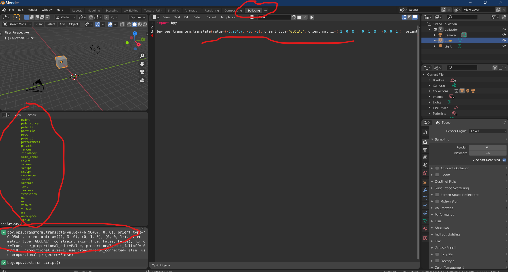

# Azure :heart: Blender

In this post I will explore running Blender in an Azure function in order to automate elements of a 3D model pipeline in a scalable and cost-effective way. I will provide a code repo of all of the elements required from the Azure Function code to an example Docker file describing the container that we will run the Azure function in to some example Python scripts which allow automation of Blender functionality.

## Content Pipeline

Just to set the scene I'll give a simple illustrative example of what I mean by a content pipeline and give some examples of what it might be used for. So, imagine that I am starting with some high-resolution 3D models that have been created with some scanning hardware and the model has too much geometry to run efficiently on a mobile device such as HoloLens or a mobile phone. I also have some software that will optimise the model for the target devices but it only takes the glTF file format as input. So if I can create a pipeline node that will convert my input file to and from glTF then I can string nodes together as below to create my content pipeline.

Blender can very easily be used to automate 3D file format conversions but can also be used to automate more complex scenarios such as:

- Generating synthetic data for input to train Machine Learning models to do object recognition

- Generating normal maps by baking lighting information from a high density 3D model onto a normal map to be used with a model that has reduced geometry so we can preserve a lot of the lighting detail.

- Generating a rendered movie of a camera orbiting around a 3D model so that the result can be checked as part of a model quality checking process

These are a few useful examples that spring to mind as I have real-world experience with these but of course, the combinations are endless and given a set of processing nodes can be configured to fit the scenario.

The rest of this post will be concerned with all aspects of setting up a pipeline like this. The moving parts we will need to understand for this are:

- How do we automate Blender to carry out the processing for nodes we might need?

- How can we host the processing in the cloud? We are going to be using the Azure cloud for this.

## Blender

Blender has been hitting the news a bit recently with some notable additions to the [Blender Development Fund](https://fund.blender.org/)

> Blender has been around for 25 years or so as a free and open source 3D content creation and rendering tool. It has become a cornerstone in the 3D pipeline and it's freeness sets it apart from some of it's competitors. The industry investment is a signal that Blender is a key piece of technology for the future landscape and another indicator that the tipping point for adoption of spatial computing is in the not-too-distant future.  

Blender can be used for 3D modeling, sculpting, creating and applying materials, rendering, character rigging, particle simulation, animation, 2D animation, editing and compositing.

> For Windows 10 users; Blender also appears in the Windows 10 Store so you can make use of auto-updates

### Blender Automation

So, as well as all of the rich functionality for 3D content creation we can also automate it using the Python scripting interface. Blender has an embedded Python interpretor and a Python library exposing most of the functionality. The first step would be to open the Scripting tab which can be found along the top of the application to the far right.

This configures Blender into a scripting friendly workspace where you have the following windows:

- 3D viewport

> The usual 3D viewport but allows you to visualise script commands as you run them

- Python console

> You can run commands here and also explore the bpy library. type **bpy.** and then press **TAB** for an autocomplete list

- Info window

> As you carry out user operations in Blender the associated script will get output here. You can copy the output from here directly into your script. (Note. this won't always give you what you want as some of the operations are highly context sensitive but it provides a good starting point)

- Text Editor (where we write the Python code)

> Enter the text for the script here, always starting with **import bpy**. Under the templates menu you can find examples of python scripting from creating add-ons to UI-driven scripts. (We're only interested in **Background Job** for now).

I'm no going to attempt a tutorial of this as there are many online already but I have included some useful tips.

#### Visual Studio Code Extension

One last tip is to point you at the VS Code Extension for Blender Development.

A little bit about WSL:Ubuntu VS code

Blender also has an embedded Python interpreter

<explore cost of running Azure functions - am I using consumption plan or appservice plan and what is the difference.>
